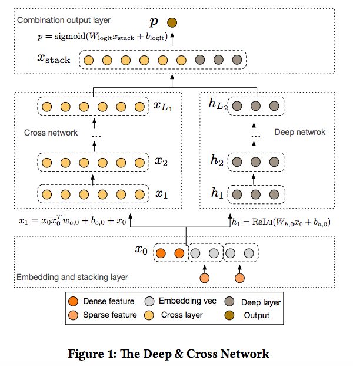
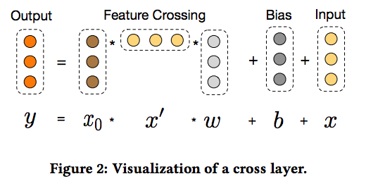
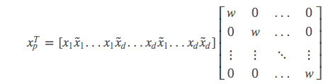
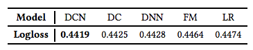

# Deep & Cross Network for Ad Click Predictions

## 应用背景

Deep & Cross Network 是为了大规模有效地寻找交叉特征，对比相同阶的DNN，DCN有更低的loss和更少的参数，且在Criteo广告点击率预测数据上得到了证明

## Deep & Cross Network

DCN按顺序主要包括几个部分：embedding and stacking layer，cross network和deep network，combination layer把cross network和deep network的输出组合。

### Embedding and Stacking Layer

- 归一化稠密特征$$x_{dense}$$
- embedding稀疏特征成稠密的vector，$$X_{embed, i} = W_{embed, i}x_i$$

$$ W_{embed, i}$$是变换的embedding matrix，同一起训练的参数。

- 然后对$$X_{embed, i} $$和$$x_{dense}$$ stack成一个vector，$$x_0 = [x_{embed, 1}^T, x_{embed, 2}^T, ..., x_{embed, K}^T, x_{dense}^T]$$

### Cross Network

cross network是由多个cross layers组成，每一层的输出为

$$x_{l+1} = x_0x_l^Tw_l + b_l + x_l = f(x_l, w_l, b_l) + x_l$$

$$x_l$$, $$x_l+1$$是第l层和第l+1层cross layer的输出，每一层学习一个和初始输入$$x_0$$特征交叉映射，拟合$$x_{l+1} - x_l$$残差。参数数量为$$d*L_c * 2$$（L_c是cross layer的数量），且每层维度一样，远小于Deep的复杂度。主要是由于$$x_0x_l^T$$的rank=1，可直接生成所有的交叉项。

### Deep Network
Deep Network是一个DNN(fully-connected feed-forward 神经网络)，隐藏层为$$h_{l+1} = f(W_lh_l + b_l)$$，激活函数是ReLU。

### Combination Layer
Combination Layer将cross network和deep network的输出拼接后传给logits层，即预测值：$$p = \delta([x_{L1}^T, h_{L2}^T]w_{logits})$$。

其中，$$x_{L1}^T$$和$$ h_{L2}^T$$是cross network和deep network的输出，$$w_{logits})$$是combination 层的权重，loss函数是带L2正则的logistic函数，对两个network联合一起训练。

## 分析Cross Network

文章从三方面分析cross network

* Polynomial Approximation
* FM 泛化：cross network的参数共享，和FM类似，只是FM交叉项的阶数是2。
* Efficient Projection：每一个cross layer，将$$x_0$$和$$x_l$$的交叉投影到输入的维度上，文章提供了一个有效的解法，将开销减少至O(d)的线性开销上。considering $$x_p = x_0x^Tw$$，实际等于

## 实验效果

* Criteo广告点击率数据数据，6天的数据作为训练集，第7天的数据随机分成验证和测试集
* tensorflow的一些参数：
	* 使用Adam optimizer，mini-batch优化
	* batch size = 512
	* Deep Network使用batch normalization，gradient clip norm = 100
* L2正则和dropout没有明显效果
* 超参数建议：
	* 隐藏层数2-5
	* 单个隐藏层size32-1024
	* cross layer 1-6层
	* 学习速率0.0001-0.001
	* 都使用了early stop，step=150000

注：early stop的做法
1. 首先将训练数据划分为训练集和验证集（划分比例为2:1）； 
2. 在训练集上进行训练，并且在验证集上获取测试结果（比如每隔５个epoch测试一下），随着epoch的增加，如果在验证集上发现测试误差上升，则停止训练； 
3. 将停止之后的权重作为网络的最终参数。 
**Early Stop能够防止过拟合。**
* 文章对比了DCN和DNN，FM，LR，W&D，DC
	* Loss 对比
	
	* DCN和DNN对比：由于DCN仅仅引入了O(d)额外的参数，更为高效省内存，在相同的结点和层数参数下，DCN的loss低于DNN

* DCN在非CTR预估问题也表现良好

## 参考文献

- Wang R, Fu B, Fu G, et al. Deep & cross network for ad click predictions[C]//Proceedings of the ADKDD'17. ACM, 2017: 12.MLA