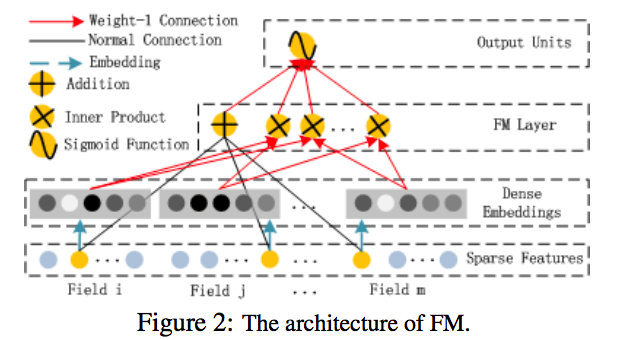
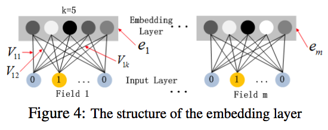
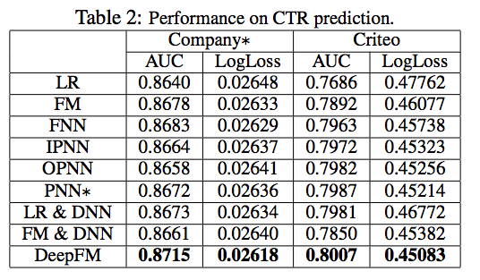

# DeepFM: A Factorization-Machine Based Neural Network For CTR Prediction

## 应用背景

Google 提出的Wide&Deep后，Wide Part是LR Model，仍然依赖人工特征工程，华为实验室提出了DeepFM，把Wide改成FM模型，从端到端的学习特征交叉，并将其应用于CTR预估场景中。

## DeepFM

整个模型主要包括两方面，FM和DNN，共享相同的输入，两边的参数和Wide&Deep一样是同时训练，其预测者是二者的加权平均。
$$\hat{y} = sigmoid(y_{FM} + y_{DNN})$$

### FM
FM因子向量机，学习一阶线性关系和二阶特征交叉的隐向量内积，即
$$y_{FM} = <w, x> + \sum_{i=1}^{d} \sum_{j=i+1}^{d} <V_i, V_j>x_ix_j$$

###  Deep
和Wide & Deep一样，是一个前馈神经网络，学习高阶特征。不同的是，CTR的输入特征高度稀疏，包括离散型，连续型和fields分组后的(性别、低于、年龄)，故在进入隐藏层之前需要将特征embedding成低维稠密的向量。

embedding层的输出为： $$a^{(0)} = [e_1, e_2, ..., e_m]$$， $$e_i$$是第i个field的embeding结果，再将$$a^{(0)}$$传递给DNN，第l隐藏层的输出为，
$$a^{(l+1)} =\delta(W^{(l)}a^{(l)} + b^{(l)})$$
生成了稠密的特征向量后，传给sigmoid激活函数，

$$y_{DNN} = \delta(w^{|H|+1}*a^H + b ^ {|H|+1})$$

其中，|H|是隐藏层的数量。

## 与其他模型的对比

| 模型 | 简介                      | 是否需要与训练 | 高阶特征 | 低阶特征 | 是否需要人工特征工程 | 缺点                                 |
| ---- | ------------------------- | -------------- | -------- | -------- | -------------------- | ------------------------------------ |
| FNN | FM初始化的结果输入到DNN中 | N              | Y        | N        | Y                    | 受FM训练结果影响；预训练导致效率问题 |
| PNN | 在embedding层和第一个隐藏层加入了product layer | Y | Y | N | Y | 忽略低阶特征的交叉 |
| Wide & Deep | LR模型和DNN同时训练参数| Y | Y | Y | N | Wide Part需要人工组合特征|
| DeepFM | 把Wide & Deep的Wide Part改成FM | Y | Y | Y | Y | Wide & Deep的扩展 |

## 实验结果
训练数据使用了Criteo Database（45 millions，9比1的训练集和测试集）和公司数据集(1billion，7天训练数据和1天测试数据)，指标使用的AUC和loss。

在两个数据集上，DeepFM都表现得比其他主流的深度模型。

## 参考文献

* Guo H, Tang R, Ye Y, et al. Deepfm: a factorization-machine based neural network for ctr prediction[J]. arXiv preprint arXiv:1703.04247, 2017.