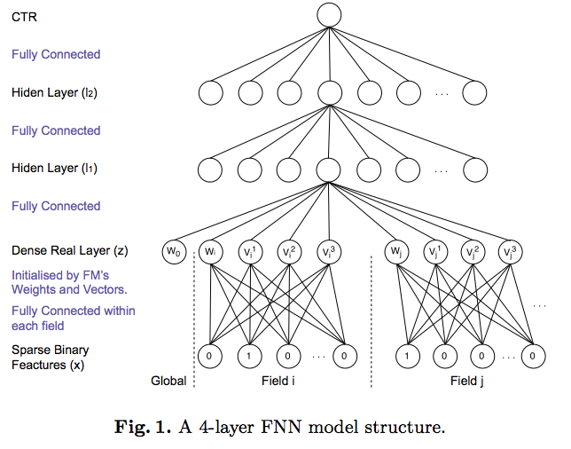
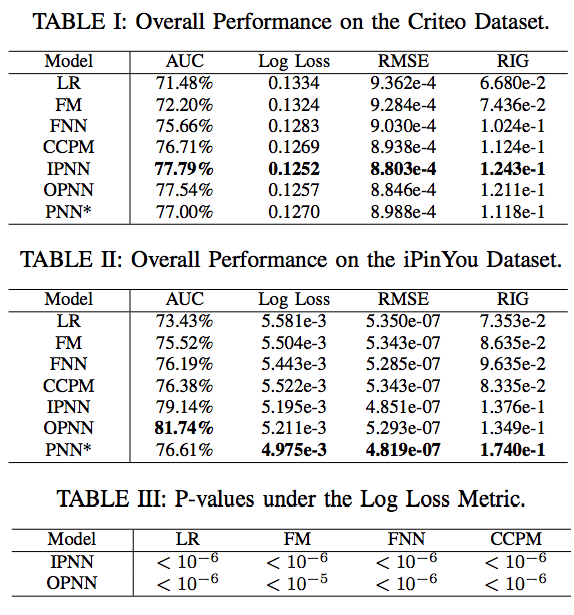

## 应用背景

实验基于User response (e.g., click-through or conversion) prediction 。

## FNN

1. 对离散值特征做one-hot
2. dense real layer对每一个field做embedding，其embedding的方法是FM模型(pre_training)
	* $$z_i = (w_i, v_i^1, v_i^2,v_i^K)$$，使用FM的结果作为初始化
4. 将FM 的结果输入全连接神经网络，含$$l_1$$和$$l_2$$两个隐藏层，最终预测
	* $$l_1 = tanh(W_1z + b_1)$$
	* $$l_2 = tanh(W_2l_1 + b_2)$$
	* $$y = sigmoid(W_3l_2 +  b_3)$$

## 实验结果
使用了Criteo和iPinYou database进行实验

## 参考文献

* Qu Y, Cai H, Ren K, et al. Product-based neural networks for user response prediction[C]//Data Mining (ICDM), 2016 IEEE 16th International Conference on. IEEE, 2016: 1149-1154.

