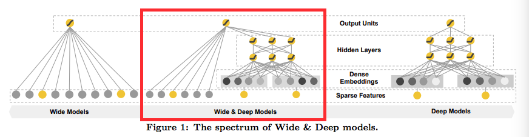
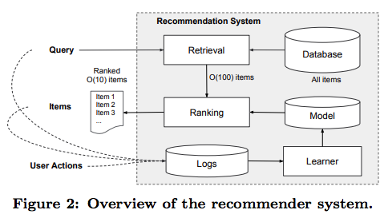
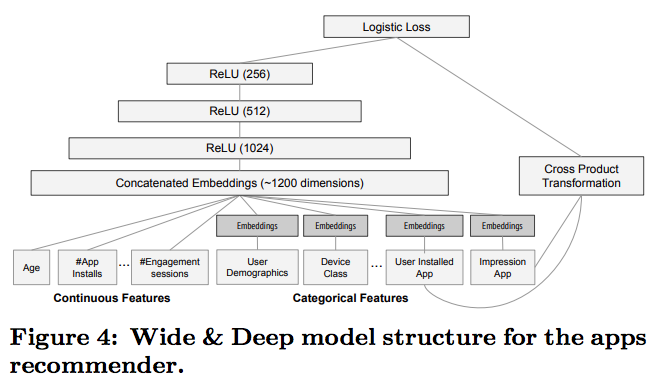
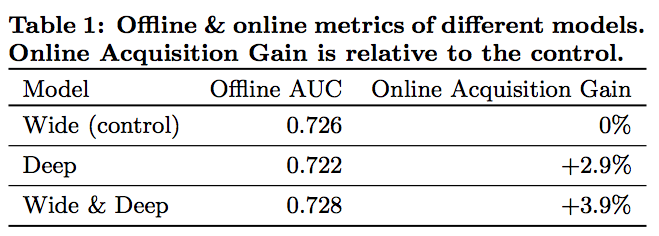

# Wide & Deep Learning for Recommender Systems

## 应用背景

Google Play 应用商店的推荐系统，其场景是用户输入查询query，根据用户和上下文信息，返回排序的推荐列表。该推荐系统，找到数据库中强相关的item（**检索**），然后根据一定的条件进行排序(**排序**)。

该任务非常重要的**memorization**和**generalization**，前者是学习历史数据中频繁出现的产品的特征，与历史行为强相关，后者是通过相关性，探索新的特征组合，更多的是提高推荐的丰富度。

为了同时满足这两点，提出了Wide&Depp Learning模型，平衡memorization和generalization。

* Wide: 使用广义线性模型，可解释性(**LR模型**)
* Deep: embedding探索训练集中未出现的高阶组合特征 (**神经网络**)

## 推荐系统框架

当用户访问app store时，会产生请求，根据曝光后用户的反馈(label=1如果app被下载，否则为0)，落地到日志中作为训练数据供模型训练。当用户输入query时，检索系统（retrieval）会返回匹配query的item list作为候选集后，由ranking对候选item进行打分后排序，返回给用户

## Wide & Deep Learning

### Wide 
Wide是一个广义的线性模型，即$$y = w^Tx + b$$，其中离散特征使用one-hot编码，连续特征被归一化到[0,1]，根据其累计分布函数的分位数归一化成$$\frac{i-1}{n_q-1}$$，包括原始特征和，稀疏特征做了**cross-product transformation**后的组合特征

### Deep——DNN
Deep是一个前馈神经网络(feed-forward NN)，对高维的稀疏离散特征做embedding，转成低维稠密的向量，维度大概10-100。该向量随机初始化后，随着模型训练最小化loss时生成，向前传递给神经网络的隐藏层，隐藏层是ReLUs的激活函数变换，其中第l层计算如下
$$a^l+1 = f(W^l a^l + b^l)$$

### Wide & Deep
将Wide&Deep模型联合同时训练，两边参数同时优化，二者的加权结果为预测值。训练方法使用的**mini-batch stochastic optimization**，paper中对比的wide用的**FTRL+L1**优化，deep则是**AdaGrad**。
$$P(Y=1|x) = \delta(w_{wide}^T[x, \phi(x)] + w_{deep}^Ta^{l_f}+b)$$

其中，$$\delta$$是sigmoid函数，w_{wide}是input特征和cross-product组合特征的权重，w_{deep}是最终激活层上的权重

### Model

* 在训练期间，输入层是sparse和dense特征，以及label。wide模型使用了user installed app和impresion app的cross-product transformation特征。deep模型，会为每个离散特征特征学到一个32维的embedding向量，再将这些embeddings和连续特征联接起来形成dense features，产生一个1200维的dense vector，再将其输入到3个ReLU层，再到logistic层。
* 由于样本超过5000亿，一般使用前一个模型的embedding和线性模型权重结果来作为下一个模型的初始化。模型加载到线上之前，会验证前一个模型sanity check(没有详说)

## 实验结果

实验指标，离线auc和在线acquisition gain，可以看出在线效果提升非常明显，对比单独的wide或者单独的deep。

## TensorFlow API 实例代码

[Github Tensorflow Wide_Deep](https://github.com/tensorflow/models/tree/master/official/wide_deep)

##参考文献

* Cheng H T, Koc L, Harmsen J, et al. Wide & deep learning for recommender systems[C]//Proceedings of the 1st Workshop on Deep Learning for Recommender Systems. ACM, 2016: 7-10.MLA
